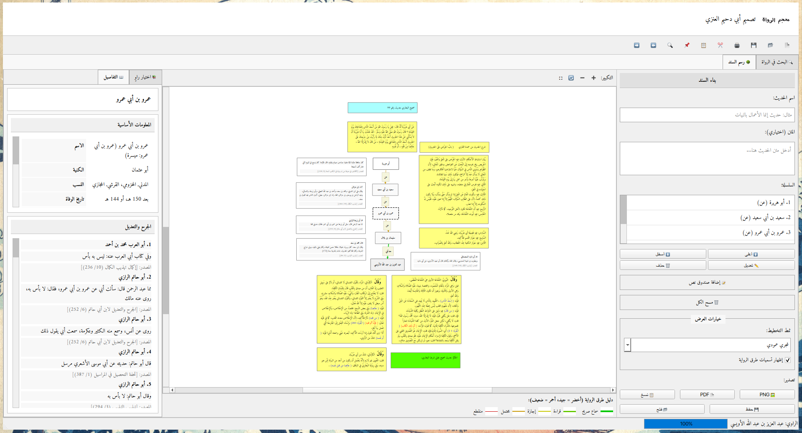

# أختر لغة || Pick a Langue 
[English](#-sanad)
[Arabic](#-sanad-سَنَد)


# 📚 **Sanad (سَنَد)**

### أداة بحث وتصوير سلاسل الإسناد في علوم الحديث

> **Sanad** هو تطبيق مكتبي احترافي يهدف إلى **تصوير وتحليل وتوثيق سلاسل الإسناد الحديثية** بأسلوب بصري منضبط، يخدم الباحث وطلاب العلم والمعلّمين، مع احترام المنهج العلمي في علوم الحديث دون ادّعاء إصدار أحكام.

---

## 📑 فهرس المحتويات

* نظرة عامة
* لماذا Sanad؟
* المزايا الرئيسية
* حالات الاستخدام
* صور من التطبيق
* البنية المعمارية
* البيانات وصيغ الملفات
* التثبيت والبناء
* دليل الاستخدام السريع
* تنبيه علمي مهم
* المساهمة في المشروع
* الرخصة
* الشكر والتقدير

---
# تحميل وتشغيل

### 🔹 Windows
1- [Download the EXE file](blob:https://github.com/fb663cee-3cbd-4757-88a0-cac9c7fb1bf6)


---

## 📖 نظرة عامة

جاء **Sanad** ليعالج إشكالية شائعة في العمل الحديثي المعاصر:
**كيف نمثّل سلاسل الإسناد المعقّدة تمثيلًا بصريًا واضحًا دون الإخلال بالمنهج العلمي؟**

يوفّر التطبيق بيئة عمل تُمكّنك من:

* بناء **سلاسل إسناد متفرعة وغير محدودة**
* الاستفادة من **قاعدة بيانات ضخمة للرواة (~19,000 راوٍ)**
* المقارنة البصرية بين الطرق والرواة
* إخراج رسومات **جاهزة للنشر الأكاديمي**
* حفظ العمل كاملًا في ملف واحد قابل للنقل والمشاركة

> Sanad لا يُصحّح الحديث ولا يُضعّفه،
> بل يضع **الأداة بين يدي الباحث**.

---

## ❓ لماذا Sanad؟

العمل التقليدي على الأسانيد يعاني من:

* التشتت بين المصادر
* صعوبة تتبع التفريعات
* ضعف التمثيل البصري
* فقدان البنية عند النشر

**Sanad** صُمّم ليكون:

* عربي التوجّه
* أكاديمي المنهج
* حيادي علميًا
* دقيقًا لا آليًا

---

## ✨ المزايا الرئيسية

### 🔹 قاعدة بيانات الرواة

* قرابة **19,000 راوٍ**
* الاسم، الكنية، النسب، اللقب
* تاريخ الوفاة
* طبقات الرواة (12 طبقة)
* أقوال الجرح والتعديل من عدة أئمة
* تصنيفات ابن حجر

---

### 🔹 محرك بحث متقدم

* بحث تقريبي (يتجاوز الأخطاء الإملائية)
* بحث دقيق
* ترتيب النتائج حسب الصلة
* فلترة حسب الطبقة
* سرعة عالية

---

### 🔹 تصوير الإسناد (N-ary)

* تفريعات غير محدودة
* أنماط عرض متعددة:

  * عمودي
  * أفقي
  * هرمي
* تلوين طرق الرواية
* دليل بصري للرموز

---

### 🔹 تحرير تفاعلي

* سحب وإفلات
* إنشاء الرواة بالنقر
* مربعات رواة فارغة
* مربعات ملاحظات حرة
* تحديث حي للوصلات

---

### 🔹 تنسيق النصوص

* خطوط عربية متعددة (Amiri، Traditional Arabic…)
* تحكم كامل بالحجم واللون
* حدود وخلفيات
* محاذاة RTL صحيحة

---

### 🔹 صيغة الملفات `.AMN`

ملف واحد يحتوي:

* بنية الإسناد كاملة
* الإحداثيات
* التنسيقات
* الرواة المضافون يدويًا
* الملاحظات

> محمول — قابل للمشاركة — قابل لإعادة البناء

---

### 🔹 التصدير

* PNG عالي الدقة
* PDF متجهي
* نسخ مباشر للحافظة

---

### 🔹 وحدة الكتب

* قارئ كتب شبيه بالشاملة
* تصنيف موضوعي
* تنقل بين الأبواب
* بحث مخصص
* تمييز النتائج

---

## 🎯 حالات الاستخدام

* البحث الأكاديمي في علوم الحديث
* التعليم والتدريس
* مقارنة طرق الإسناد
* إعداد رسوم للمجلات العلمية
* تحليل الطبقات زمنيًا
* أرشفة مشاريع بحثية كاملة

---

## 🖼️ صور من التطبيق


```md

```

---

## 🏗️ البنية المعمارية للتطبيق

```
src/
├── controllers/     # منطق الأعمال
├── models/          # نماذج البيانات
├── ui/              # واجهات PyQt6
├── graphics/        # العقد والوصلات
├── utils/           # أدوات مساعدة
└── main.py          # نقطة التشغيل
```

> التصميم يراعي:
>
> * الفصل بين المكونات
> * سهولة التوسعة
> * الصيانة طويلة الأمد

---

## 💾 البيانات وصيغ الملفات

### ملفات الرواة (JSON)

* سيرة منظمة
* أقوال الجرح والتعديل معزوّة
* مصادر موثقة

### ملفات `.AMN`

* مبنية على JSON
* مقروءة بشريًا
* تحفظ الحالة البصرية كاملة
* مستقلة عن قاعدة البيانات

---

## 🛠️ التثبيت والبناء

### المتطلبات

* Python ≥ 3.8
* PyQt6
* rapidfuzz

```bash
pip install PyQt6 rapidfuzz
```

### التشغيل

```bash
python src/main.py
```

### بناء ملف تنفيذي

```bash
pip install pyinstaller
pyinstaller --onefile --windowed src/main.py
```

يدعم:

* Windows
* Linux
* macOS

---

## 📝 دليل الاستخدام السريع

1. تشغيل التطبيق
2. تحميل قاعدة بيانات الرواة
3. البحث عن راوٍ
4. إضافته إلى اللوحة
5. بناء السلسلة
6. ضبط التنسيق
7. الحفظ أو التصدير

---

## ⚠️ تنبيه علمي مهم

**Sanad أداة بحث وتصوير فقط**.

لا يقوم بـ:

* تصحيح الحديث
* تضعيفه
* إصدار أحكام شرعية

المسؤولية العلمية كاملة على الباحث.

---

## 🤝 المساهمة في المشروع

نرحّب بالمساهمات:

1. Fork للمستودع
2. إنشاء فرع
3. Commit للتعديلات
4. Pull Request

---

## 📄 الرخصة

GNU public Licence 
حر الاستخدام والتعديل والنشر.

---

## حقوق الملكية

* **التصميم والتطوير:** عبد الله العنزي (أبو دحيم)
* **الخط والتصميم البصري:** أ. الفيفي
* **شكر خاص:** للمختبرين الأوائل والمساهمين

---
# 📚 **Sanad**

### Hadith Isnad Visualization & Research Tool

[](https://github.com/hitaex-sanad/sanad/actions/workflows/build-windows.yml)

> **Sanad** is a professional desktop application for visualizing, analyzing, and documenting Hadith chains of narration (Isnad) in a structured, scholarly, and visually expressive manner.

---

## 📑 Table of Contents

* Overview
* Why Sanad?
* Key Features
* Use Cases
* Screenshots
* Architecture
* Data & File Formats
* Installation & Build
* Usage Guide
* Scholarly Disclaimer
* Contributing
* License
* Credits

---

## 📖 Overview

**Sanad** is built for Hadith researchers, students, and educators who work with chains of narration and need more than static text or handwritten diagrams.

It allows you to:

* Construct **complex isnad trees** with unlimited branching
* Explore **nearly 19,000 narrator biographies**
* Visually encode narration strength
* Export **publication-ready diagrams**
* Preserve complete work in a portable `.amn` format

Sanad does **not** judge Hadith authenticity — it empowers *you* to analyze, compare, and present chains clearly and rigorously.

---

## ❓ Why Sanad?

Traditional isnad work often suffers from:

* Fragmented sources
* Manual diagramming
* Loss of structure in publications
* Poor visual comparison of chains

**Sanad solves this** by combining classical hadith methodology with modern visualization and data handling.

It is:

* Arabic-first
* Research-oriented
* Academically neutral
* Built for precision, not automation

---

## ✨ Key Features

### 🔹 Comprehensive Narrator Database

* ~19,000 narrators
* Kunya, nasab, laqab, death dates
* Ibn Ḥajar rankings
* Jarḥ wa Taʿdīl from multiple scholars
* Tabaqāt classification (12 generations)

### 🔹 Advanced Search Engine

* Fuzzy search (typos & partial names)
* Exact search
* Multi-field indexing
* Relevance ranking
* Instant Tabaqāt filtering

### 🔹 N-Ary Isnad Visualization

* Unlimited branching
* Vertical / Horizontal / Pyramid layouts
* Color-coded narration methods
* Built-in method legend

### 🔹 Interactive Graph Editing

* Drag & drop nodes
* Right-click contextual building
* Blank narrator boxes
* Floating annotation boxes
* Live connection updates

### 🔹 Rich Text Styling

* Font families (Amiri, Traditional Arabic, Arial…)
* Size, color, bold/italic/underline
* Background & border control
* RTL-aware alignment

### 🔹 Universal `.AMN` File Format

Self-contained files including:

* Full chain hierarchy
* Exact coordinates
* Visual styles
* Embedded custom narrators
* Notes & annotations

Portable. Shareable. Reproducible.

### 🔹 Export Options

* PNG (high resolution)
* PDF (vector)
* Clipboard copy
* Metadata preservation

### 🔹 Books Module

* Shamela-style reader
* Multi-book categories
* Chapter navigation
* Scoped searching
* Highlighted results

---

## 🎯 Use Cases

* Academic Hadith verification
* Teaching isnad methodology
* Comparing multiple transmission paths
* Preparing diagrams for journals
* Visual analysis across generations
* Archiving research projects

---

## 🖼️ Screenshots


```md

```

---

## 🏗️ Application Architecture

```
src/
├── controllers/     # Business logic
├── models/          # Data models
├── ui/              # PyQt6 UI
├── graphics/        # Visual nodes & edges
├── utils/           # Helpers & threading
└── main.py          # Entry point
```

Designed for:

* Separation of concerns
* Extensibility
* Long-term maintenance

---

## 💾 Data & File Formats

### Narrator JSON

* Structured biography
* Scholar-attributed Jarḥ wa Taʿdīl
* Source-cited

### `.AMN` (Al-Ameenah / Isnad)

* JSON-based
* Human-readable
* Visual state preserved
* Database-independent

---

## 🛠️ Installation & Build

### Requirements

* Python ≥ 3.8
* PyQt6
* rapidfuzz

```bash
pip install PyQt6 rapidfuzz
```

### Run

```bash
python src/main.py
```

### Build Executable

```bash
pip install pyinstaller
pyinstaller --onefile --windowed src/main.py
```

Supports:

* Windows
* Linux
* macOS

---

## 📝 Usage Guide (Quick)

1. Launch application
2. Load narrator database
3. Search narrator
4. Add to canvas
5. Build chain via right-click
6. Adjust layout & style
7. Save as `.amn` or export

---

## ⚠️ Scholarly Disclaimer

Sanad is a **research and visualization tool**.

It does **not**:

* Grade Hadith authenticity
* Issue rulings
* Replace scholarly judgment

All conclusions remain the responsibility of the researcher.

---

## 🤝 Contributing

Contributions are welcome:

1. Fork repository
2. Create feature branch
3. Commit changes
4. Open Pull Request

---

## 📄 License

GPL — free to use, modify, and distribute.

---

## 🙏 Credits

* **Design & Development:** عبد الله العنزي (أبو دحيم)
* **Calligraphy & Visual Design:** أ. الفيفي
* **Special Thanks:** Early testers & contributors

---

## 🔗 Links

* GitHub Repo:
  [https://github.com/hitaex-sanad/sanad](https://github.com/hitaex-sanad/sanad)
* Releases:
  [https://github.com/hitaex-sanad/sanad/releases](https://github.com/hitaex-sanad/sanad/releases)

